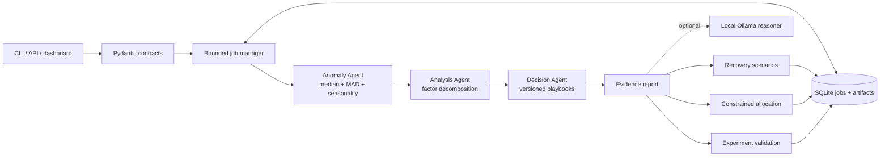

# Growth Decision Agent

[](https://github.com/JINGbai77/growth-agent/actions/workflows/ci.yml)
[](https://www.python.org/)
[](#verification)

An evidence-grounded decision-support service for growth analytics. It accepts daily
channel-level funnel data, detects unusual changes using causal-in-time baselines, decomposes the
change into traffic and conversion contributions, and turns findings into guarded investigation
plans. A decision lab adds counterfactual recovery scenarios, constrained budget allocation, and
A/B experiment planning and evaluation.

The default path runs fully offline. An optional local Ollama layer may propose additional
hypotheses, but model output is schema-validated, linked to known anomaly IDs, clearly marked as
unverified, and never blocks the statistical report.

## Why this is more than a rule demo

| Capability | Engineering or analytical decision |
|---|---|
| Anomaly detection | Per-channel median/MAD baseline, same-weekday seasonality, three gates, no future-data leakage, cold-start abstention |
| Attribution | Exact two-factor Shapley decomposition of `new_users = visitors × conversion` |
| Decisions | Versioned playbooks with owners, metrics, guardrails, and mandatory human approval |
| Counterfactuals | Conditional factor-recovery scenarios with assumptions; never presented as causal uplift |
| Budget planning | Discrete optimal allocation for separable concave response curves, channel caps, conservative factors |
| Experimentation | Sample-size planning, two-proportion test, Wilson intervals, SRM checks, fixed-horizon and Holm safeguards |
| Agent operations | SQLite job persistence, bounded workers, idempotency, restart recovery, replay and derived-artifact lineage |
| Optional AI | Local structured Ollama output, evidence-reference validation, bounded input/output, deterministic fallback |
| Service quality | Strict typed contracts, 4 MiB streaming limit, structured errors/logs, readiness checks, container and CI |

## System architecture



The pipeline keeps three concepts separate:

1. **Observation:** an unusual measured change against a historical baseline.
2. **Arithmetic attribution:** how much of the user-count change came from traffic and conversion.
3. **Causal hypothesis:** a possible explanation that still requires validation through an
   experiment or operational check.

See [docs/architecture.md](docs/architecture.md) for contracts, algorithms, failure behavior and
trade-offs.

## Quick start

Python 3.11 or newer is required.

```bash
python -m venv .venv
# Windows: .venv\Scripts\activate
# macOS/Linux: source .venv/bin/activate
python -m pip install -r requirements-dev.lock
python -m pip install --no-deps -e .
python -m growth_agent.main demo --output reports/demo.json
uvicorn growth_agent.api:app --reload
```

Open <http://127.0.0.1:8000> for the interactive demo and
<http://127.0.0.1:8000/docs> for OpenAPI documentation. The example is deterministic simulated
data, identified as such in both code and API responses.

Docker is also supported:

```bash
docker compose up --build
```

The container binds to localhost and persists job history in a named volume. Use one application
process per SQLite database; an OS-held scheduler lease rejects unsafe multi-process ownership.

## Use with your own data

Input is JSON or CSV with one row per `(date, channel)`:

```json
{
  "records": [
    {"date": "2025-01-06", "channel": "ads", "visitors": 10000,
     "new_users": 1000, "spend": 2000}
  ],
  "options": {"seasonality": "weekday"},
  "use_llm": false
}
```

```bash
python -m growth_agent.main analyze examples/sample_request.json --output reports/result.json
curl -X POST http://127.0.0.1:8000/v1/analyze \
  -H "Content-Type: application/json" --data @examples/sample_request.json
```

The default weekday baseline abstains until eight prior matching weekdays exist. For data known
to have no weekly pattern, set `seasonality` to `none`; this uses the rolling history after the
configured warm-up. Duplicate dates, invalid funnel counts, unknown fields, non-finite values and
oversized inputs are rejected.

## Durable workflow

```bash
# Submit an asynchronous, persisted job. Repeating the same key and payload returns the same job.
curl -X POST http://127.0.0.1:8000/v1/jobs \
  -H "Content-Type: application/json" -H "Idempotency-Key: portfolio-demo-1" \
  --data @examples/sample_request.json

# Then use the returned UUID.
curl http://127.0.0.1:8000/v1/jobs/JOB_ID
curl http://127.0.0.1:8000/v1/jobs/JOB_ID/report
curl -X POST http://127.0.0.1:8000/v1/jobs/JOB_ID/replay
```

The decision-lab endpoints derive scenarios, budget plans and experiment evaluations from a
completed job and persist the lineage to that source report. Example bodies are in
[examples/README.md](examples/README.md).

## Optional local LLM

Install [Ollama](https://docs.ollama.com/) and a model, then copy `.env.example` to `.env`:

```bash
ollama pull qwen2.5:7b
# Set GROWTH_LLM_ENABLED=true in .env
python -m growth_agent.main demo --llm
```

The integration uses Ollama's [structured outputs](https://docs.ollama.com/capabilities/structured-outputs).
The server controls whether LLM calls are allowed; clients can only request enrichment. If the
provider times out, returns malformed JSON, duplicates evidence IDs or invents an ID, the service
returns the complete deterministic report with `llm.status = "fallback"`. No API key is needed.

## Verification

```bash
ruff format --check .
ruff check .
pytest
python -m build --no-isolation
python -m growth_agent.main benchmark --seeds 50 --iterations 50
```

Current local verification: **74 tests passed, 97.97% statement coverage**, lint passed and both
sdist/wheel built. Tests include future-leakage, ordering invariance, seasonal baselines, malformed
model output, provider timeout, persisted replay, backpressure, restart recovery, optimizer versus
exhaustive search, known Wilson/Holm references, SRM and premature-decision guardrails.

### Reproducible simulated benchmark

Run on Python 3.12.14 / Windows 11, engine `0.2.0`, 50 seeds × 9 generated scenarios. The timed
section includes request validation, the offline pipeline and JSON serialization; it excludes
HTTP, SQLite and LLM calls. Three warmups precede 50 timed iterations.

| Detector | Precision | Recall | F1 | False positives |
|---|---:|---:|---:|---:|
| Robust seasonal detector | 0.750 | 1.000 | 0.857 | 150 |
| Causal rolling-mean comparator | 0.153 | 0.889 | 0.261 | 2,219 |

| Input rows | Median | p95 |
|---:|---:|---:|
| 252 | 3.211 ms | 6.300 ms |
| 9,999 | 194.027 ms | 234.406 ms |

The 150 false positives all occur in the intentionally high-noise scenario. This exposes a real
limit: MAD with eight same-weekday points does not model changing variance. Production use should
calibrate thresholds on labeled history or add a heteroskedastic model. These figures are simulator
performance and local runtime measurements, not revenue impact, hours saved or production SLA.
The complete machine-readable result is in
[benchmarks/benchmark-windows-python312.json](benchmarks/benchmark-windows-python312.json).

## Project scope

This repository demonstrates analytical and engineering judgment: data contracts, causal-in-time
evaluation, uncertainty guardrails, reproducibility, failure isolation and traceable decisions.
It does not connect to advertising accounts or spend money, infer real-world causality, or claim
production business outcomes. SQLite plus an in-process executor is suitable for a single-node
portfolio service; a production deployment requiring horizontal scale should replace it with a
shared queue/database and add authentication, tenant isolation and monitoring.

## Repository map

```text
growth_agent/
  agents/          detection, attribution and playbook agents
  service/         pipeline, durable jobs and decision-lab routes
  static/          local interactive demo
  benchmark.py     deterministic evaluation and latency harness
  experiments.py   experiment planning and guarded evaluation
  planning.py      counterfactual and budget optimization modules
  storage.py       job/report/artifact persistence
tests/             unit, integration, property-style and failure-path tests
benchmarks/        checked-in machine-readable benchmark result
examples/          API request examples
docs/              architecture and portfolio notes
```

## License

MIT — see [LICENSE](LICENSE).
